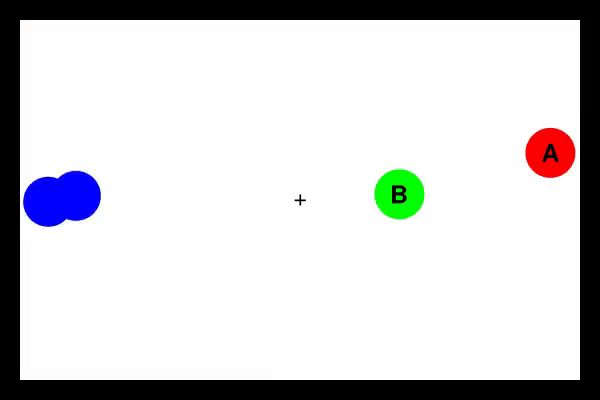
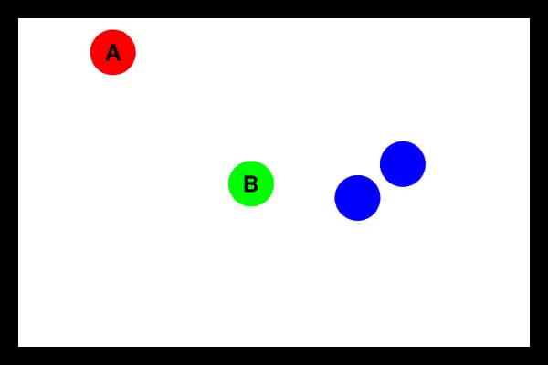

# diss


Human beings possess an innate understanding of physics. We can, for example, predict that an object will fall just by **observing** how it's standing on a table or learn a ball's weight by passing it from hand to hand. 'When' these abilities are acquired and 'how' our brain performs are a matter of discussion among scientists. [Bramley et al., 2018] developed an environment to better assess our abilities at guessing these hidden properties. Using the environment shown below, participants were tasked with guessing the mass of the labelled pucks and the attraction or repulsion forces acting between them.  



During my MSc Dissertation I tackled the same task presented in the paper with Recurrent Neural Networks. My goal: developing RNNs capable of guessing physical properties with human accuracy. Firstly, I modelled the problem as a supervised learning problem to match the condition in which the participants are only allowed to observe the environment and **matched** their accuracy! (WOOHOO!). After, I developed Reinforcement Learning agents capable of interacting with the environment and tasked with also answering the questions. Although the results didn't improve the accuracy from passive observation, they are a stepping stone towards developing RL agents capable of actively learning. As a result, this repository contains the code developed and experiments run during my (Héctor Otero Mediero's) MSc Dissertation in the University of Edinburgh (MSc in Artificial Intelligence). 

# Table of contents
1. [The environment and task](#the-environment-and-task)
2. [Libraries](#libraries)
3. [Notebooks](#notebooks)
4. [Installation Guide](#installation-guide)
5. [References](#references)


# The environment and task
We are presented with an environment that includes four pucks that move according to Newtonian physics. We are tasked with answering questions regarding the **target pucks** (labelled A and B). The remaining distractor pucks (painted blue) are there just to complicate the task (they can attract/repel the target pucks and provoke collisions).

Two types of questions are asked:

- Which puck is heavier? 'A', 'B' or do they weigh the 'same'?
- Do the pucks 'attract', 'repel' or 'no force' acts between them?

Three different conditions are evaluated:

- Passive: the participant watches a replay in which the pucks move freely with no outside intervention. (See Replay A)
- Active: the participant is allowed to interact with the pucks, dragging, launching, etc as they please. (See Replay B)
- Yoked: the participant watches a replay of another participant's actively interacting with the environment. 



*Same environment as in Replay A, but this time the participant is allowed to drag the pucks around.*


# Libraries

- `simulator`: includes the code necessary to generate the physical environment and generate passive trials or run active simulations.  Its main configuration can be checked in `environment.py`.
- `isaac`: all the tools necessary to generate datasets with passive simulations, postprocess them and train Recurrent Neural Networks to predict the environment's latent physical properties (mass or force). Also includes code to evaluate the resulting models and visualize trials. **Unit tests** for the code in this library are incldued in `tests/isaac_tests`.
- `toddler`: library to train and test Reinforcement Learning agents. Includes code for training RDQN (Recurrent Deep Recurrent Q-learning) agents.


# Notebooks
### diss_results
Notebooks spawning from the experiments performed during my Master's dissertation and their corresponding visualization. These include:
##### Passive
- RNN cell type selection. (Notebooks 0 and 0b).
- Feature selection (Notebooks 1a, 1b, 1c).
- Sequence length selection. (Notebooks 2 and 2b).
- Sequence resolution selection (Notebooks 3 and 3b).
- Long training processes (Notebooks 4, 4b, 4c, 6, 6b, 6c).
- Transfer learning experiments (Notebooks 5 and 5b).
- Multi-branch neural network experiments. (Notebooks 6, 6b, 6c, 8, 9, 9b, 10, 10b, 11 and 11b).
- Evaluation of passive models on yoked data. (Notebook 8).
- Training of models on yoked data. (Notebooks 9, 9b, 10, 10b, 11 and 11b).
##### Active
- Learning to grab a puck with Reinforcement Learning. (Notebooks 13 (3 of them)).
- Learning to answer questions with Reinforcement Learning (Notebooks 14 (3 of them)).
- Mixed approach: control the mouse through RL and delegate the answering to a supervised learning agent. (Notebooks 15 (3 of them)).
### statistical_analysis
- Creating a dataset from human data belonging to [Intuitive experimentation in the physical world [Bramley et al. 2018]](https://doi.org/10.1016/j.cogpsych.2018.05.001). 
- Diverse statistical comparisons between the results from human and RNN models. 

# Installation guide

To run the notebooks and/or libraries in this repository, it is necessary to install some dependencies.
The file `conda_environment.yml` lists these dependencies and can be directly used to create a
Conda environment with them installed (see [HERE](https://docs.conda.io/projects/conda/en/latest/user-guide/install/index.html)
for a tutorial on how to install Conda). Once Conda is available, run:
```
conda env create -f conda_environment.yml
conda activate diss
pip install ./libraries
```
These commands will first create an environment named "diss", then activate it and install in it the
libraries in the repository ("isaac", "simulator" and "toddler"). Once this is done, the environment
should be ready to run the notebooks. In case you want to install the libraries in developer mode
substitute the last line by `pip install -e ./libraries`

To remove the environment and all its installed libraries execute:
```
conda deactivate
conda remove -y --name diss --all
```

# REFERENCES
Bramley, N. R., Gerstenberg, T., Tenenbaum, J. B., & Gureckis, T. M. (2018). Intuitive experimentation in the physical world. Cognitive Psychology, 105, 9–38. https://doi.org/10.1016/j.cogpsych.2018.05.001


