# Appendix Materials

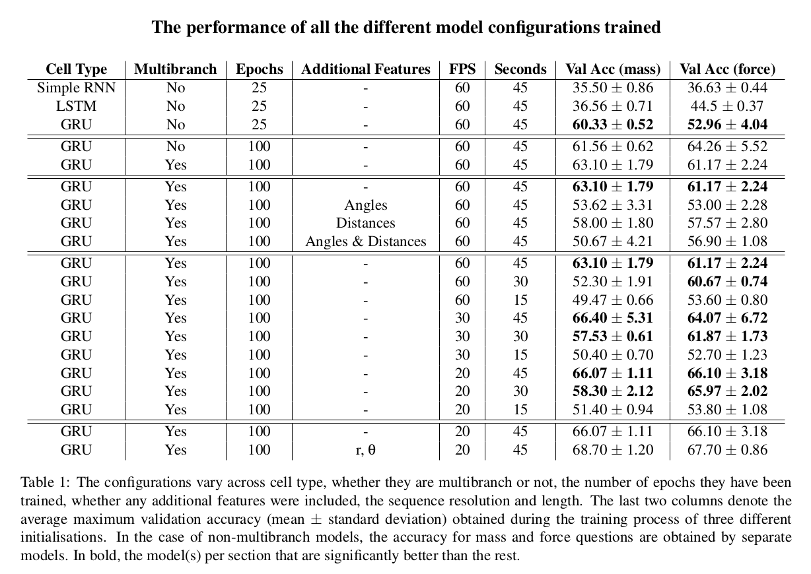

## The percentage of participants and RNN selecting an answer is correlated
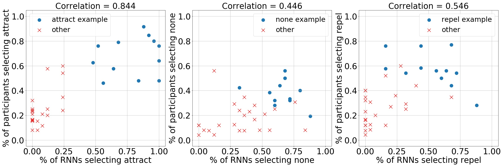
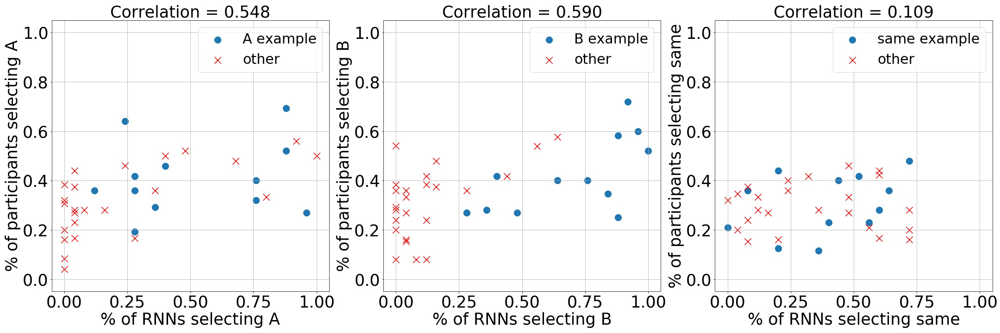

Across the different trials, the percentage of participants and of RNNs choosing each option is positively correlated for both force questions (ρattract = 0.844, ρnone = 0.446 and ρrepel=0.546) and mass questions (ρA = 0.548, ρB = 0.590 and ρsame=0.109). Percentages of 'attract' answers are the most strongly correlated while 'same' examples only show a correlation of 0.109.

## The probabilities assigned by the RNN to each class are correlated with the percentage of participants choosing that answer
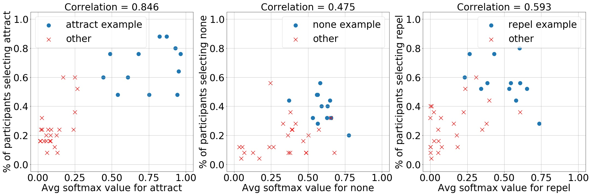
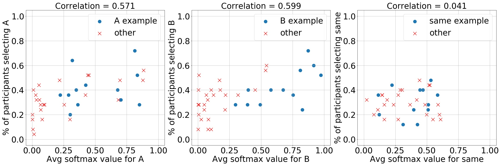

This correlation can also be found between the softmax output of the RNNs (i.e. the probability that they assigns to each one of the classes) and the percentage of participants choosing that class. The  correlation coefficients are similar to those found before: ρattract = 0.846, ρnone = 0.475 and ρrepel=0.593; ρA = 0.571, ρB = 0.599 and ρsame=0.041. 

## RNN and participant certainty is positively correlated
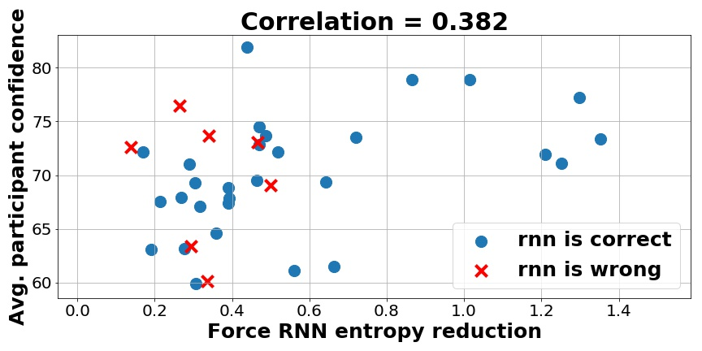
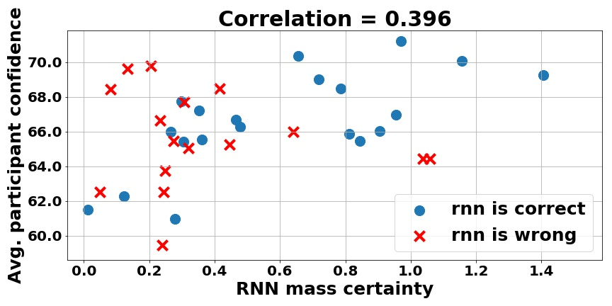

The participants' confidence submitted with their answers (i.e. how certain they are of their answer is correct) is plotted against the RNNs certainty for the same trial. These two values appear to be positively correlated for both question types: 0.382 for force questions and 0.396 for mass questions. In other words, questions where the RNN assigns a large probability value to one of the options often correspond to those where participants are most confident.

## The IO certainty and participant accuracy is only correlated for force questions
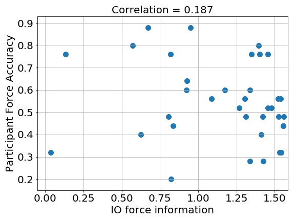 
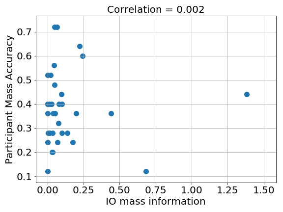

The confidence obtained using the Ideal Observer model is less correlated with participant accuracy for force questions (ρ = 0.187) and not correlated at all for mass questions (ρ ≃ 0.002).

## The IO and participant confidence is only correlated for force questions
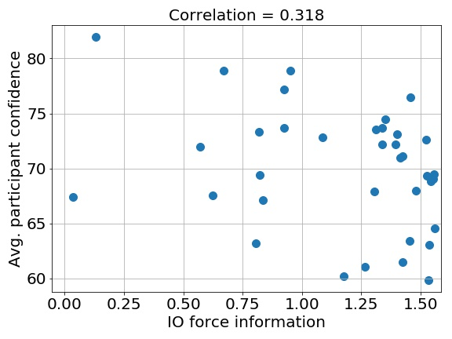 
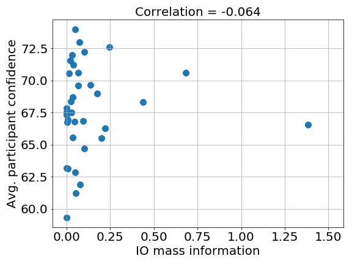

If compared with participant confidence, the IO confidence is positively correlated (ρ = 0.318) while for mass questions this value is again very close to 0 (ρ = -0.064).

## The RNN and IO certainty is only correlated for force questions
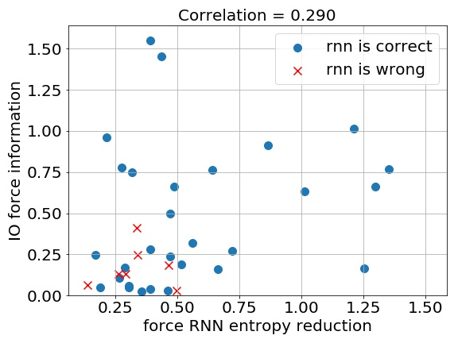 
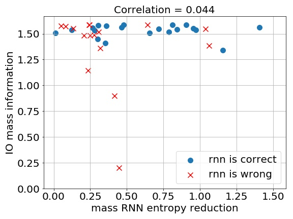

Similarly, between the Ideal Observer's confidence and the RNN certainty there exists a correlation for force (ρ = 0.290) but not for mass questions (ρ = 0.044).

## Statistics for interval information taking PD as ground truth
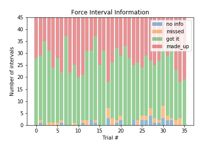
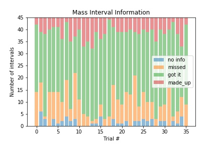

By taking the Predictive Divergence as ground truth for the evidence (recalling that in using the true simulator the IO model was never systematically wrong but just more or less confident), we can compute for each interval whether the RNN correctly identifies it, misses it or ''hallucinates'' nonexistent evidence. The RNN correctly captures 56±12% of the force evidence, for 2±2% of the intervals it misses the contained evidence and, finally, for 39±11% of the intervals it makes up evidence. In comparison, for mass evidence, the RNN correctly captures a significantly higher proportion 63±11% (t(36)=2.45, p=0.016) of the evidence and makes up a significantly lower amount of evidence 14±6% (t(36)=11.53, p < 0.001). However, it also misses significantly more evidence: 19±10% (t(36)=8.67, p < 0.001).

## The most correlated example for force evidence.
[Its corresponding REPLAY](https://raw.githubusercontent.com/iamhectorotero/learning-physical-properties-with-rnns/cogsci-2020-experiments/cogsci_experiments/cogsci_images/force_PD_RNN_good_example.mp4) 
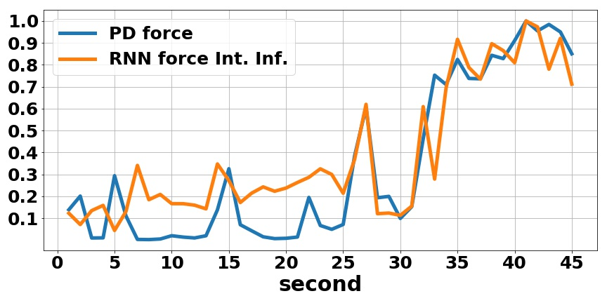

## The negatively correlated example for mass evidence
[Its corresponding REPLAY](https://raw.githubusercontent.com/iamhectorotero/learning-physical-properties-with-rnns/cogsci-2020-experiments/cogsci_experiments/cogsci_images/mass_PD_RNN_bad_example.mp4)
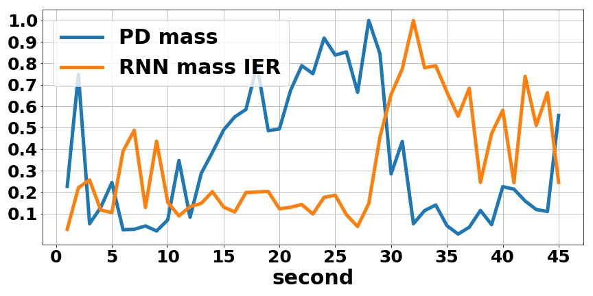

## A comparison between RNN Force Interval Information and Predictive Divergence Force for every trial
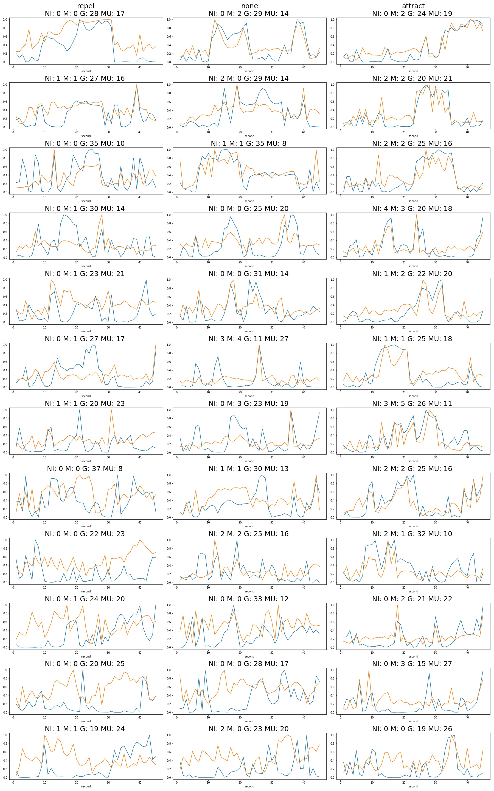

## A comparison between RNN Mass Interval Information and Predictive Divergence Mass for every trial
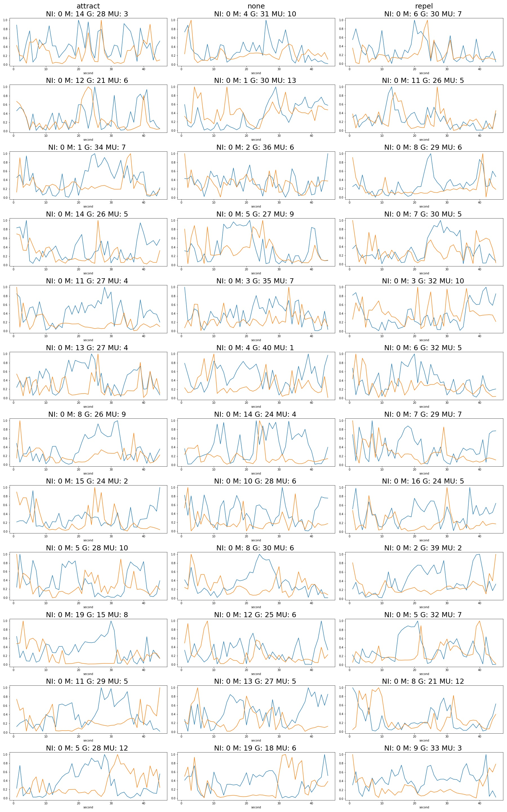
